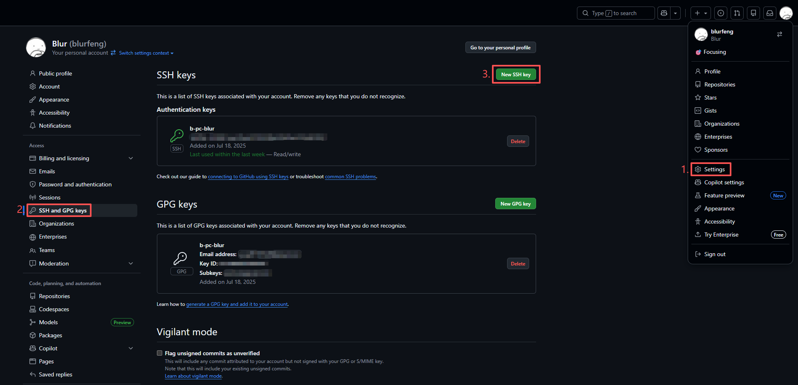
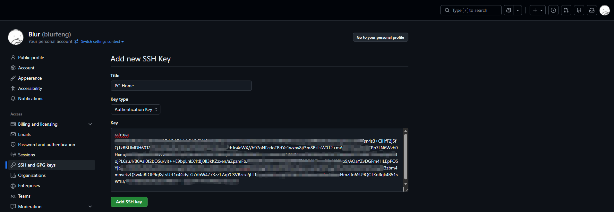
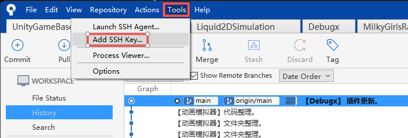
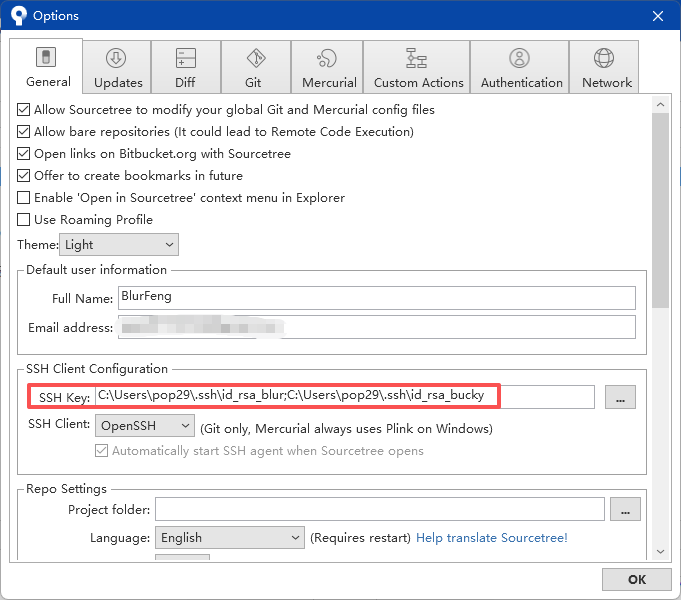

<h1 align="center"> 使用 SSH 密钥连接 GitHub 并同步代码</h1>

## 简介
和远端托管仓库进行同步的方式有很多。   
通常我们使用 HTTPS 与远程仓库同步最为方便，但当本地存在多个 GitHub 账户、并开发多个项目时，使用 SSH 会更加高效。   
如果继续使用HTTPS在每次上传时都需要确认上传者的身份，增加了操作步骤。

## 什么是 SSH
SSH（Secure Shell）是一种加密的远程登录协议，用于在不安全的网络中安全地远程访问另一台计算机。   
简单地说，SSH 就像是一把安全的“数字钥匙”，你用它可以远程进入一台电脑（比如云服务器），或者安全地连接 GitHub、GitLab 等平台来推送代码。

## 使用 SSH 密钥管理项目仓库
这里我们以 GitHub 仓库为例，为账户创建不同的 SSH 密钥。并配置到 GitHub 账户。   
除了 GitHub，还常用于远程登录 Linux 服务器、SCP 文件传输等。

### 创建 SSH 密钥
首先打开终端（Terminal / Git Bash）。   
假设你有账号`accountA`，之后的命令中的名称部分替换成你自己的账户名称。   
`name@gmail.com`的部分替换为你自己的邮箱。
使用以下命令生成密钥：

    ssh-keygen -t rsa -b 4096 -C "name@gmail.com" -f ~/.ssh/id_rsa_accountA

使用 -f 参数可以自定义 SSH 密钥文件名，以避免多个密钥之间冲突。   
> [!TIP]
> 如果你只使用一个默认的 SSH 密钥，也可以不指定名称。那么生成的文件名为`id_rsa`。  
> 但我建议自己指定名称，为以后管理多个 SSH 密钥做准备。

之后需要你设置密码，建议不设置密码。   

密钥将默认保存在你的用户目录下的 .ssh 文件夹中：
- Windows: C:\Users\YourName\\.ssh\
- macOS 或 Linux: ~/.ssh/

密钥文件有两个，分别是 `id_rsa_accountA` 私钥和 `id_rsa_accountA.pub` 公钥两个文件。\
.pub 为公钥，将在之后配置到远端，而私钥保存在本地。

### 创建 config 来配置多个 SSH 信息
假设你创建了多个 SSH ，那么需要创建一个 config 来告知如何使用不同的 SSH。   
> [!TIP]
> config 文件也放在 .ssh\ 文件夹下。

你可以通过以下方法创建和编辑config文件：   
- 方法1：创建`config.txt`并输入配置内容。然后去掉`.txt`文件类型。
- 方法2：在 Git Bash 中使用 `cd ~/.ssh/` 命令行移动到.ssh文件夹，然后使用 `vim config` 命令行创建 config 后编辑。
- 方法3：使用 VS Code 或 notepad 之类的工具进行编辑。

假设我创建了`accountA`和`accountB`两个账户的 SSH 密钥文件，并需要配置到 config。   
在 config 中输入：

    # accountA
    Host github.com-accountA
      HostName github.com
      User git
      IdentityFile ~/.ssh/id_rsa_accountA

    # accountB
    Host github.com-accountB
      HostName github.com
      User git
      IdentityFile ~/.ssh/id_rsa_accountB
> [!TIP]
> `_accountA`和`_accountB`部分修改为你的用户名。或在使用默认 SSH 文件时可以移除。

#### Host
`Host`是你定义的别名，推荐在`github.com`后添加账号标识，例如`github.com-accountA`，以便区分多个账户。   
#### HostName 和 User
`HostName`和`User`一般要按照远端仓库的要求，在使用 GitHub 时，必须按如上填写。   
#### IdentityFile
`IdentityFile`中需要输入指向的密钥文件路径。

### 配置 SSH 公钥到 GitHub
然后，我们需要将 SSH 公钥配置到远端仓库。   
#### 1. 复制公钥
你可以在 Git Bash 中输入以下命令，来查看并复制公钥：   

    cat ~/.ssh/id_rsa_accountA.pub

或者直接用txt文本或任何可用方式打开公钥文件来复制公钥。   
> [!TIP]
> `_accountA`部分修改为你的用户名。或在使用默认 SSH 文件时可以移除。

#### 2. 配置公钥到仓库
打开 GitHub，在 Settings > SSH and GPG keys 界面下，点击 `New SSH key` 按钮打开界面。   

Title 可以写设备名称或任意。Key type 默认 Authentication Key。黏贴 SSH 公钥到 Key 中。   

### 测试 SSH 连接
在 Git Bash 中输入以下命令来测试连接：

     ssh -T git@github.com-accountA
> [!TIP]
> `-accountA`部分修改为你的用户名。或在使用默认 SSH 文件时可以移除。

如果连接成功，将显示：

    Hi YourName! You've successfully authenticated, but GitHub does not provide shell access.

> [!TIP]
> 如果 config 没有正确配置会导致连接失败。   
> 需要注意的是，如果你是默认的ssh名称 `id_rsa` 可以直接使用 `ssh -T git@github.com` 命令你个来进行连接测试。   
> 如果你设置了密钥密码，但没有使用 ssh-agent 或 ssh-add 载入密钥，则可能会导致连接失败或频繁要求输入密码。   

### 克隆你的仓库
从 GitHub 页面复制的 SSH 链接是 `git@github.com:UserName/repo.git`，但你使用的是配置了别名的 SSH，需要改成：

    git@github.com-accountA:UserName/repo.git

> [!TIP]
> `-accountA`部分修改为你的用户名。或在使用默认 SSH 文件时可以移除。

🎉使用此路径克隆到本地。然后你就可以自由地上传和拉取项目了。

## 从 HTTPS 改为 SSH
如果你之前使用 HTTPS ，想改为 SSH ，输入以下命令来改变 remote 路径：

    git remote set-url origin git@github.com-accountA:UserName/repository.git
> [!TIP]
> `-accountA`部分修改为你的用户名。或在使用默认 SSH 文件时可以移除。

## 在 Sourcetree 中使用多个 SSH
首先，你需要按上面的步骤创建多个 SSH 和一个 config，并配置 SSH 公钥到 GitHub 账号。   
然后在 Sourcetree 中添加 SSH 和启用 SSH Agent 来自动使用 SSH 密钥。

### 添加 SSH
点击菜单 Tools > Add SSH key... 并选中私钥文件添加。   
使用到的多个私钥都需要添加。   

### 确认 SSH 配置
点击菜单 Tools > Options 打开选项界面。   
在 SSH Client Configuration 项目下，`SSH Key`一栏应当显示你添加的多个 SSH 私钥路径，通常以分号或列表方式分隔。   
`SSH Client`一栏选择 `OpenSSH`。   

### 关于 SSH Agent
默认 SSH Agent 是自动启动的，有时候如果 SSH 连接不上，可以点击 Tools > Launch SSH Agent 来尝试重新启动一次 SSH 代理。

## 常见问题 FAQ
#### Q: 为什么我用 git@github.com:gitaccount/project.git 连接的是错误账号？
你可能忘来修改 SSH 链接对应你的 Host 别名。   
比如：git@github.com`-accountA`:gitaccount/project.git
#### Q: 每次 push 都要求我输入密码？
你的 SSH 密钥设置了密码，但没有通过 ssh-agent 自动加载。